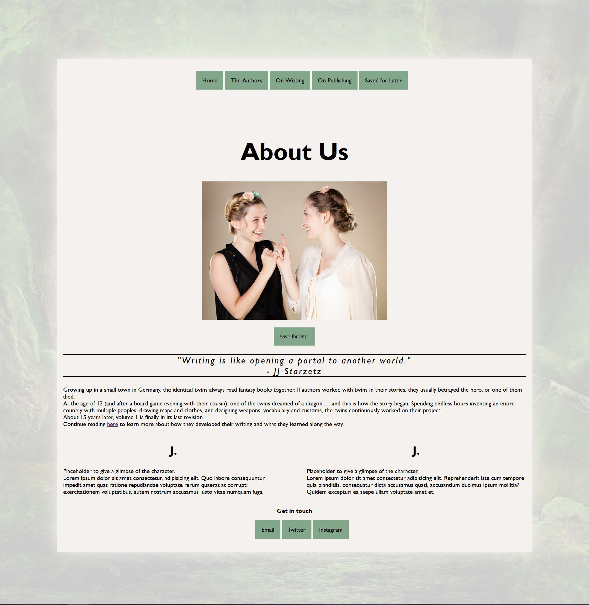

# finalCapstone - My first Website

# Content
## Description
## Installation
## Usage & Screenshots
## Credits

## Description
The website displays content for fantasy-book authors and their first novel. It consists of 5 pages

1. The landing page (index).

It displays a map of the country, information on the main characters, the blurp and book cover, and a sign up form for users to become test readers.
It uses images, forms, flexboxes.

2. About the authors (The authors.)

It shows a picutre of the authors, a short biography and how they got into writing.
It uses an image and grid.

3. On Writing

It describes how the authors got into writing and useful links on writing. It has a form for users to contribte their tips and like other user's comments.
It uses images, links to external sites.

4. On Publishing

It shows a table with pros & cons of self-publishing or the traditional publishing route.

5. View Later

All images can be saved to view later. Using session storage and DOM Manipulation, all images that have been saved are displayed on the "View later" page.
## Installation
Clone the repository with git clone [url].
## Usage
The website has no specific usage as it is just a website.
This is a screenshot of it:

## Credits
No one else worked on this project.
